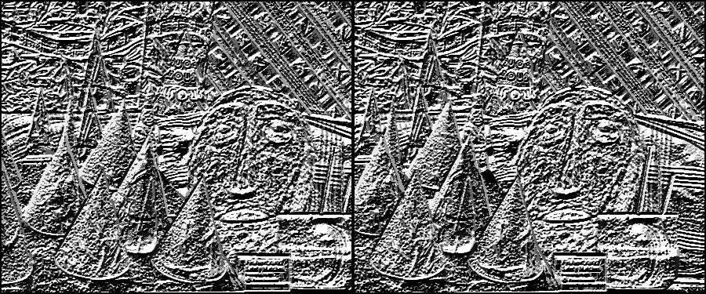
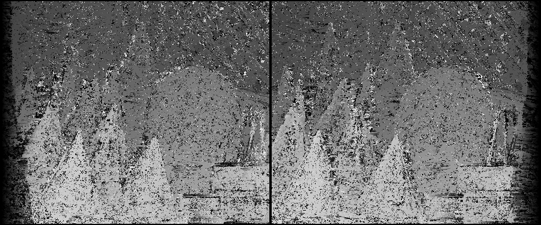
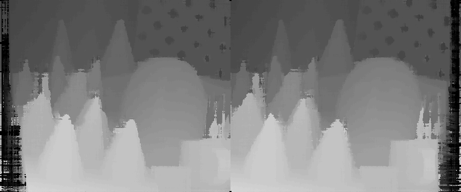
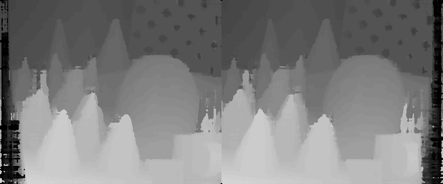
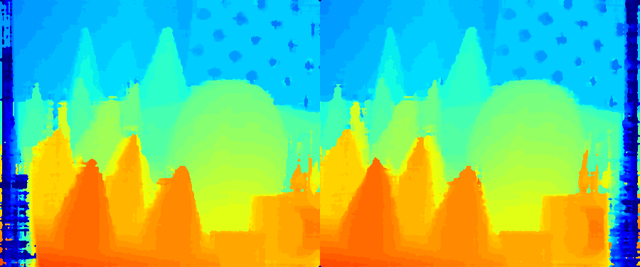

### Welcome to my open source machine learning projects!
Stick around if you want to take a deep dive into the technical side of machine learning. I follow a first principles approach to all my projects. This means some of the projects can require a significant amount of time to completely understand, but don't let that demotivate you. The knowledge you will gain is invaluable. I provide supplimentary material in all my Readme's, so take a look at those if you get stuck. Most of my projects require a basic level of understanding in machine learning. If you are new to machine learning you will likely be out of your depth, but don't worry I have the perfect material to get you started:
- [Course 1: Neural Networks and Deep Learning](https://youtube.com/playlist?list=PLkDaE6sCZn6Ec-XTbcX1uRg2_u4xOEky0&si=NhiDvnRof3kJAPll)
- [Course 2: Improving Deep Neural Networks](https://youtube.com/playlist?list=PLkDaE6sCZn6Hn0vK8co82zjQtt3T2Nkqc&si=BX_6q4Yj1cs0cWVw)
- [Course 3: Structuring Machine Learning Projects](https://youtube.com/playlist?list=PLkDaE6sCZn6E7jZ9sN_xHwSHOdjUxUW_b&si=ii7J-1icW7Gkj7Fw)
- [Course 4: Convolutional Neural Networks](https://youtube.com/playlist?list=PLkDaE6sCZn6Gl29AoE31iwdVwSG-KnDzF&si=t3_AKAoACBEJNFos)
- [Course 5: Sequence Models](https://youtube.com/playlist?list=PLiWO7LJsDCHcpUmL9grX9WLjyi-e92iCO&si=PMnEeVMSG8LCG04P)

I don't focus on the deployment and maintenance side in my open source projects because this is dependant on your deployment enviroment, which is highly variable. This makes my project relevent to a much larger audience. I provide all the tools necessary to understand how to create the machine learning models, but you need to be familiar with your deployment environment to productionise the models. Check the material below if you want to learn about deploying and maintaining models in production:
- [Machine Learning Engineering for Production (MLOps)](https://youtube.com/playlist?list=PLkDaE6sCZn6GMoA0wbpJLi3t34Gd8l0aK&si=agNrrw_FW4ldwsZC)

## My Background
**Professional Career:** I work full time as a Machine Learning Engineer. I work professionally on the end-to-end model development lifecycle from prototyping to deploying and maintaining models in production. 

**Studies:** My studies in university were in pure mathematics, applied mathematics and physics. This gave me a strong foundation in the theory side of machine learning. I've learnt to leave no stone unturned, because anything you don't fully understand might come back to bite you once the complexity ramps up. You will see this approach reflected in all my projects. 

**Interests:** My interests are in Computer Vision, Reinforcement Learning, Natural Language Processing, Explainable AI and Recommenders. This is by no means an exhaustive list, my interest are constantly expanding as the machine learning landscape evolves.

## How to Contact me
You're welcome to [connect with me on LinkedIn](https://www.linkedin.com/in/christian-orr-271692180/)!

If you spot a bug you're welcome to log an issue in the repo and I will take a look when I get a moment. 

# My Projects
I've organised my projects by category below:

## Deep Learning Fundamentals:

jax-basic-neural-network

Repo: [jax-basic-neural-network](https://github.com/ChristianOrr/jax-basic-neural-network)

### Summary:

This is the most fundamental implementation of deep learning. All the necessary components required to train a neural network are created from scratch. Usually neural networks are created with frameworks like Flax, Pytorch, or Tensorflow, which abstract away most of the information, so its nice to see what neural networks look like when you strip away all the abstraction layers. The MNIST dataset was used as the test bed for this demonstration. All the models achieved higher than 80% accuracy, proving they all worked effectively. 

**If you're new to machine learning, I highly suggest you check this project out!**

## Computer Vision:

stereo-camera-calibration

Repo: [stereo-camera-calibration](https://github.com/ChristianOrr/stereo-camera-calibration)

### Summary:
Stereo camera calibration is performed to remove distortion and rectify the stereo images. Distortion is present in all cameras to some extent, but it is most extreme in fish eye lenses. Rectification ensures the cameras are pointing in the same direction. Stereo depth algorithms use cross-correspondence to estimate depth, which relies on the cameras pointing in the same direction. Stereo camera calibration is a precursor to depth estimation. The depth estimation accuracy will depend on the calibration. It is essential to get the calibration right if you want good depth estimation performance.

semi-global-matching-numpy

Repo: [semi-global-matching-numpy](https://github.com/ChristianOrr/semi-global-matching-numpy)

### Summary:
SGM is a popular classic depth estimation algorithm, known for having good accuracy and speed. Newer stereo depth estimation models like [madnet-deep-stereo-with-keras](https://github.com/ChristianOrr/madnet-deep-stereo-with-keras) have much higher accuracy, but need to be trained first and require more compute during inference. This makes SGM and excellent option for resource constrained situations.

### SGM Transformation Process
The SGM algorithm follows the following process to achieve the depth estimation prediction.

1. The SGM process starts with a pair of rectified stereo images. 

2. The stereo pair is converted to grayscale.

3. A Gaussian blur filter is applied to smooth the images.

4. The census transform is then applied to the images.

5. The Hamming distance is applied to the census values to calculate the cost volume.

6. A cost aggregation technique is applied to remove the noise from the cost volume.

7. A median blur filter is applied to remove the streaking.

8. **Optional:** The disparity can then be converted to colour to see the depth better. Red indicates closer and blue further away.

madnet-deep-stereo-with-keras

Repo: [madnet-deep-stereo-with-keras](https://github.com/ChristianOrr/madnet-deep-stereo-with-keras)

confidence-measures

Repo: [confidence-measures](https://github.com/ChristianOrr/confidence-measures)

semantic-segmentation

Repo: [semantic-segmentation](https://github.com/ChristianOrr/semantic-segmentation)

## Reinforcement Learning

reinforcement-learning-algorithms

Repo: [reinforcement-learning-algorithms](https://github.com/ChristianOrr/reinforcement-learning-algorithms)

## Explainable AI

feature-attribution-methods-jax

Repo: [feature-attribution-methods-jax](https://github.com/ChristianOrr/feature-attribution-methods-jax)

## Sequential Models

transformers

Repo: [transformers](https://github.com/ChristianOrr/transformers)

sequential-ft-transformer

Repo: [sequential-ft-transformer](https://github.com/ChristianOrr/sequential-ft-transformer)

